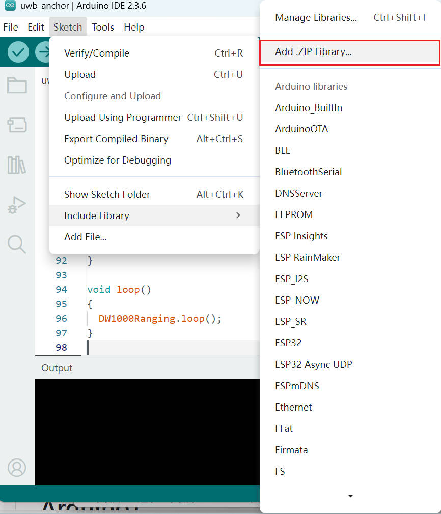
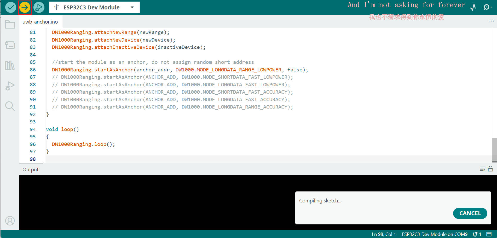

# YCHIOT DWM1000 module driver program（based ESP32-C3，Arduino）
**Read this in other languages: [English](README_en.md), [中文](README.md).**

## **Start**

1.Arduino install DW1000_library.zip library.

2.open example，compile&upload

